# Tutorial Lengkap Ubuntu Server untuk PW 1.5.5

Tutorial ini ditulis untuk pengguna yang belum pernah memasang Ubuntu Server
di **VirtualBox**. Ikuti urutannya tanpa melewati bagian OpenSSH dan port
forwarding. Untuk Proxmox bridge, gunakan ringkasan konfigurasi dan alamat
di [README.md](README.md); port forwarding VirtualBox tidak diperlukan.

## 1. Yang dibutuhkan

- Windows 10/11 64-bit.
- Oracle VirtualBox 7.x.
- RAM komputer minimal 12 GB; 16 GB lebih nyaman.
- Ruang kosong minimal 25 GB untuk VM dinamis. Kapasitas virtual yang dibuat
  adalah 50 GB.
- Koneksi internet untuk paket Ubuntu, sekitar 200 MB atau lebih.
- Folder paket ini dalam keadaan lengkap.

Folder juga menyertakan cache 209 paket `.deb` dari Ubuntu 20.04 yang dipakai
oleh instalasi teruji. Cache tersebut mengurangi ketergantungan pada mirror,
tetapi internet tetap dianjurkan untuk indeks dan pembaruan keamanan.

Paket Ubuntu yang dipasang otomatis meliputi:

- runtime 32-bit: `libc6:i386`, `libstdc++6:i386`, `libgcc-s1:i386`,
  `zlib1g:i386`, `libncurses5:i386`, dan `libssl1.1:i386`;
- kompatibilitas binary lama: `libstdc++5:i386`, `libpcre3:i386`,
  `libxml2:i386`, serta `libtask.so` terverifikasi;
- Java: `openjdk-8-jre-headless` untuk `authd`;
- database: MariaDB Server/Client;
- alat: OpenSSH, rsync, curl, OpenSSL, binutils, file, pax-utils, unzip, dan LVM.

## 2. Membuat VM VirtualBox

1. Buka VirtualBox dan pilih **New**.
2. Nama VM: `PWKU-Server`.
3. ISO Image: pilih `ubuntu-20.04.6-live-server-amd64.iso` dari folder ini.
4. Type: **Linux**; Version: **Ubuntu (64-bit)**.
5. Matikan opsi unattended installation bila VirtualBox menampilkannya. Tutorial
   ini memakai installer manual agar semua pilihan terlihat.
6. Memory: **6144 MB**.
7. Processor: **1 CPU**. Ini konfigurasi yang terbukti stabil pada komputer
   pengujian. Setelah server stabil, komputer lain boleh mencoba 2 CPU.
8. Buat VDI baru, dynamically allocated, ukuran **50 GB**.

Sebelum VM dinyalakan, buka **Settings**:

- System > Motherboard: pastikan **Enable I/O APIC** aktif.
- System > Processor: 1 CPU.
- Storage: ISO Ubuntu terpasang pada optical drive.
- Network > Adapter 1: **NAT** dan **Cable Connected** aktif.

Pada Network > Adapter 1 > Advanced > Port Forwarding, masukkan:

| Name | Protocol | Host IP | Host Port | Guest IP | Guest Port |
|---|---|---:|---:|---:|---:|
| ssh | TCP | 127.0.0.1 | 2223 | kosong | 22 |
| pw-web | TCP | 127.0.0.1 | 8081 | kosong | 8080 |
| pw-client | TCP | 127.0.0.1 | 29001 | kosong | 29000 |

Pengikatan ke `127.0.0.1` berarti server hanya dapat diakses dari komputer host,
sehingga aman untuk pengujian lokal. Jangan membuka ke internet sebelum firewall,
password, dan rencana keamanan disiapkan.

## 3. Cara memakai installer Ubuntu

Navigasi dilakukan dengan tombol:

- panah untuk berpindah;
- `Tab` untuk pindah ke tombol bawah;
- `Space` untuk mencentang;
- `Enter` untuk memilih.

### 3.1 Installer update

Pilih **Continue without updating**. Pembaruan OS tetap dipasang kemudian oleh
skrip otomatis.

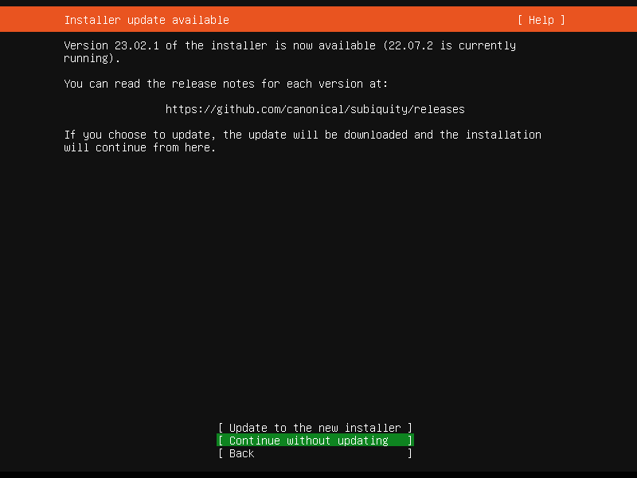

### 3.2 Keyboard

Pilih **English (US)** untuk Layout dan Variant, lalu **Done**.

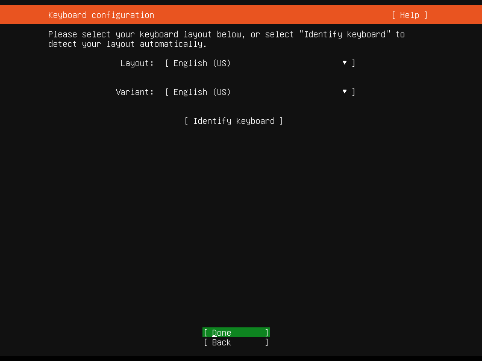

### 3.3 Jaringan

Biarkan adapter memperoleh alamat dengan DHCP. Pada NAT VirtualBox biasanya
terlihat alamat seperti `10.0.2.15/24`. Pilih **Done**.

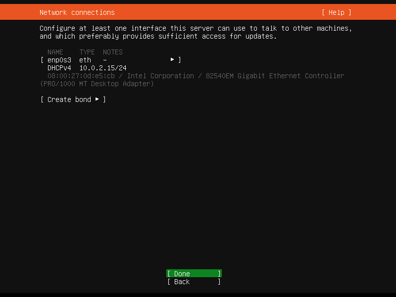

### 3.4 Proxy

Biarkan **Proxy address** kosong, kemudian **Done**.

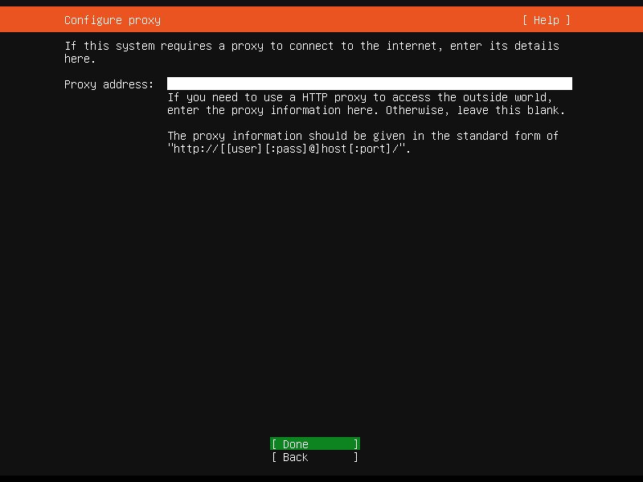

### 3.5 Mirror Ubuntu

Biarkan mirror bawaan. Di Indonesia installer dapat memilih
`http://id.archive.ubuntu.com/ubuntu`. Pilih **Done**.

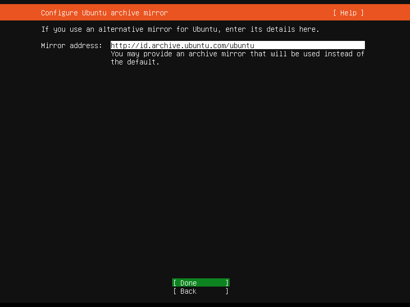

### 3.6 Penyimpanan

Pilih:

- **Use an entire disk**;
- disk virtual 50 GB;
- **Set up this disk as an LVM group** aktif;
- enkripsi LUKS tidak perlu untuk server lokal ini.

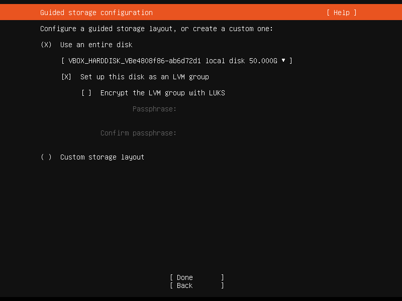

Pada ringkasan, Ubuntu 20.04 dapat membuat root sekitar 24 GB dan menyisakan
ruang dalam volume group. Ini normal; installer otomatis PWKU memperluas root
dengan sisa ruang ketika dijalankan.

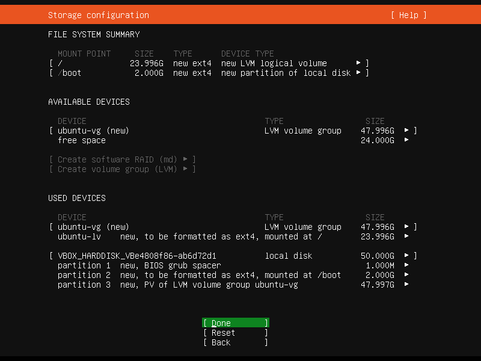

Pilih **Done**, lalu pada peringatan penghapusan disk pilih **Continue**. Yang
dihapus hanyalah VDI virtual yang baru dibuat, bukan drive Windows.

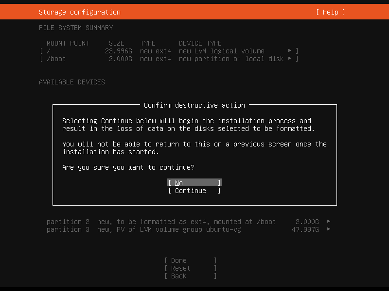

### 3.7 Profil pengguna

Contoh yang sama dengan server ini:

- Your name: `PWKU Admin`
- Your server's name: `pwku-server`
- Pick a username: `pwadmin`
- Password: buat password kuat dan catat.

Username hanya boleh huruf kecil, angka, tanda minus, atau underscore. Jangan
memakai spasi. Installer satu-klik meminta username ini; nilai bawaannya
`pwadmin`.

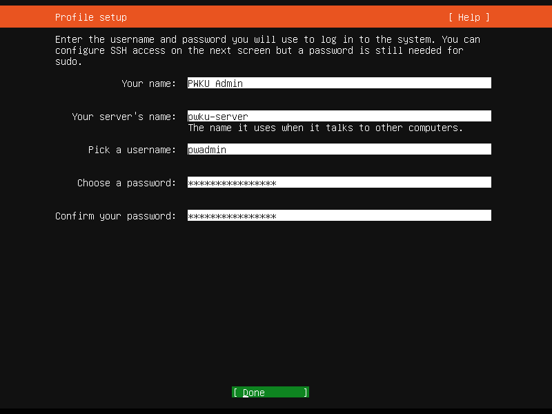

### 3.8 OpenSSH

Centang **Install OpenSSH server**. Biarkan import identity **No**. Password
authentication boleh aktif untuk setup lokal karena port SSH hanya diteruskan ke
`127.0.0.1`.

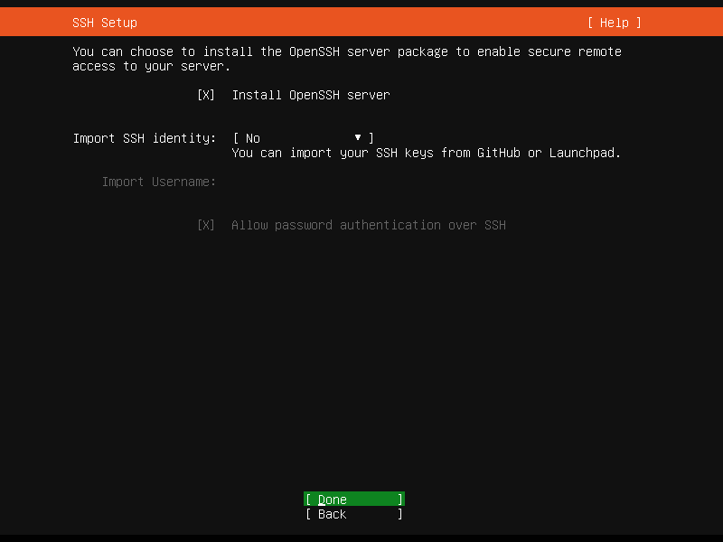

Pada layar Featured Server Snaps, jangan memilih apa pun dan pilih **Done**.

### 3.9 Menunggu instalasi

Tunggu hingga judul berubah menjadi **Install complete!**. Proses update bisa
lama. Bila opsi **Cancel update and reboot** sudah tersedia dan bagian utama
menunjukkan OpenSSH serta bootloader selesai, opsi itu dapat dipakai; pilihan
paling aman adalah menunggu sampai tombol **Reboot Now** tampil.

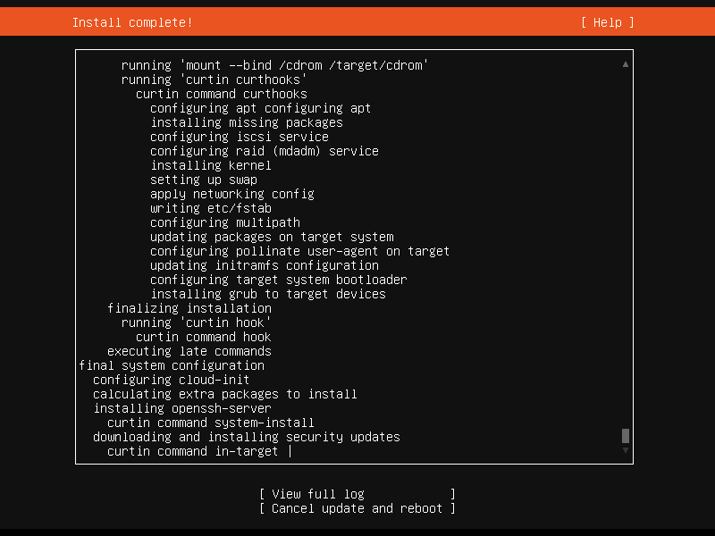

Setelah reboot, bila diminta melepas media instalasi:

1. VirtualBox > Devices > Optical Drives;
2. lepaskan ISO Ubuntu;
3. tekan Enter.

Login memakai username dan password yang dibuat pada langkah profil.

## 4. Menjalankan installer otomatis PW + web

Pastikan layar Ubuntu sudah menampilkan prompt login dan VM masih hidup.

1. Di Windows, buka folder `PWKU-Installer`.
2. Klik dua kali **INSTALL-PW-SERVER.cmd**.
3. Untuk konfigurasi tutorial ini, cukup tekan Enter pada tiga pertanyaan:
   `127.0.0.1`, port `2223`, dan user `pwadmin`.
4. Ketik password Ubuntu saat diminta. Karakter password memang tidak terlihat.
5. Skrip mengirim sekitar 1,4 GB, memasang library, MariaDB, skema, server,
   panel web, monitor, backup, dan auto-start.
6. Tunggu sampai muncul `INSTALASI PW 1.5.5 SELESAI`.

Jangan menutup jendela ketika proses `apt`, ekstraksi, atau startup map sedang
berjalan. Startup awal dapat memerlukan beberapa menit.

## 5. Memeriksa hasil

Di Windows:

- buka <http://127.0.0.1:8081>;
- login awal: `admin` / password acak yang tampil pada akhir instalasi;
- ganti password setelah login;
- gateway client: `127.0.0.1:29001`.

Untuk masuk lewat SSH:

```powershell
ssh -p 2223 pwadmin@127.0.0.1
```

Di Ubuntu, periksa layanan:

```bash
sudo /srv/pw155/tools/pw155-service.sh status
sudo bash /home/pwadmin/support/verify-install.sh
```

Daftar yang harus `RUNNING`: `logservice`, `authd`, `uniquenamed`, `gamedbd`,
`gacd`, `gfactiond`, `gdeliveryd`, `glinkd`, `gs01`, dan `is61`.

## 6. Operasi harian

```bash
# Status
sudo /srv/pw155/tools/pw155-service.sh status

# Restart seluruh server game
sudo /srv/pw155/tools/pw155-service.sh restart

# Stop seluruh server game
sudo /srv/pw155/tools/pw155-service.sh stop

# Start seluruh server game
sudo /srv/pw155/tools/pw155-service.sh start

# Log layanan web
sudo journalctl -u pw155-web.service -n 100 --no-pager

# Log auto-start game
sudo journalctl -u pw155-game.service -n 100 --no-pager
```

Backup database dibuat setiap hari pukul 03:30 WIB dan disimpan selama 14 hari
di `/srv/pw155/backups/database`.

### Backup manual dari Admin Panel

1. Login ke Admin Panel dan buka bagian **Backup & download database**.
2. Centang konfirmasi, lalu klik **Buat backup sekarang**.
3. Muat ulang halaman setelah beberapa saat.
4. Klik **Download** pada arsip yang sudah selesai untuk menyimpan salinan ke laptop/PC admin.

Backup manual berisi database game `pw`, database portal `pw_portal`, metadata,
dan checksum SHA-256. Salinan tetap disimpan di VM/VPS selama 14 hari; file yang
diunduh ke PC tidak terpengaruh oleh masa retensi tersebut. Game tidak perlu
dimatikan karena dump dibuat secara konsisten menggunakan transaksi database.

## 7. Masalah yang umum

### E_FAIL / SessionMachine VirtualBox

VM kemungkinan sudah berjalan secara headless. Jangan menekan Start lagi.
Gunakan panel web/SSH, atau matikan VM dengan benar sebelum memulai mode GUI.

### SSH tidak tersambung

- Pastikan VM hidup.
- Pastikan OpenSSH dicentang saat instalasi.
- Periksa NAT port forwarding host `2223` ke guest `22`.
- Tunggu 1–2 menit setelah boot.

### Web belum terbuka sesaat setelah boot

Server memuat daemon dan map berurutan. Tunggu 2–3 menit, lalu muat ulang
<http://127.0.0.1:8081>.

### Soft lockup ketika memakai lebih dari satu CPU

Matikan VM dengan benar, ubah Processor menjadi 1 CPU, lalu hidupkan kembali.
Konfigurasi satu CPU adalah baseline paket ini.

### Export otomatis ke host

`Export ke Host` otomatis sengaja tidak diaktifkan karena membutuhkan shared
folder VirtualBox. Layanan opsional ini tidak lagi dihitung sebagai kegagalan
pada Admin Panel. Gunakan bagian **Backup & download database** untuk membuat
backup di VM/VPS dan mengunduhnya secara manual ke PC admin.

## 8. Keamanan sebelum dibuka ke LAN/internet

Konfigurasi paket ini ditujukan untuk server privat lokal. Sebelum mengubah Host
IP port forwarding menjadi `0.0.0.0` atau memakai bridged networking:

- ganti password Ubuntu dan admin panel;
- gunakan SSH key dan matikan password authentication;
- pasang firewall dan hanya buka port yang diperlukan;
- gunakan HTTPS/reverse proxy untuk panel;
- buat backup ke media lain;
- jangan mengekspos MariaDB port 3306.
